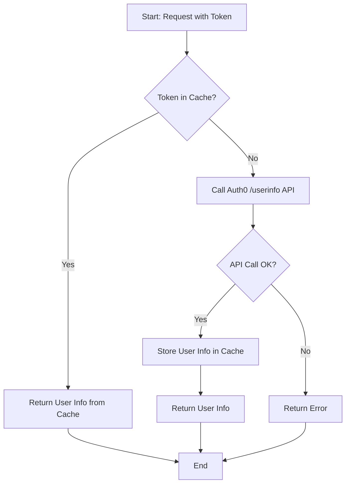

# Auth0 /userinfo 速率限制问题解决方案

本文档详细描述了在集成 Auth0 后遇到的 `429 Too Many Requests` 问题，以及通过在后端引入缓存机制来解决该问题的完整方案。

## 1. 问题描述

### 现象
在前端应用中，用户登录成功后，部分 API 请求（如获取对话列表）会失败，浏览器网络请求返回 `429 Too Many Requests` 错误。

### 根源分析
通过检查 Auth0 Dashboard 的日志，我们发现以下错误：
```
"description": "You passed the limit of allowed calls to /userinfo with the same user."
```
这表明我们的后端服务调用 Auth0 的 `/userinfo` 接口过于频繁，触发了 Auth0 的速率限制。根据 Auth0 文档，免费套餐下，此接口对同一用户的调用限制为**每分钟 10 次**。

### 原因
我们最初的设计是，在后端每一个受保护的 API 请求中，都会执行以下流程：
1.  验证前端传来的 Access Token。
2.  使用该 Token 调用 Auth0 的 `/userinfo` 接口以获取最新的用户信息（特别是 email）。

当用户在前端快速执行多个操作（例如页面加载时同时获取用户、对话列表、消息等），就会在短时间内发出多个 API 请求，导致后端在 1 分钟内调用 `/userinfo` 的次数轻易地超过了 10 次，从而被限流。

## 2. 解决方案：引入缓存

为了解决这个问题，我们决定在后端服务中为 `/userinfo` 的响应添加缓存。

*   **策略**：对于同一个 Access Token，只有在缓存中找不到对应用户信息或缓存已过期时，才真正向 Auth0 发起请求。否则，直接从缓存中返回用户信息。
*   **工具**：使用 Python 的 `cachetools` 库，它提供了 `TTLCache` (Time-To-Live Cache)，非常适合此场景。
*   **缓存有效期 (TTL)**：我们将有效期设置为 1 小时 (3600 秒)。这意味着即使用户信息在 Auth0/GitHub 上发生了变更，我们的后端最多也只会有 1 小时的数据延迟，这在当前场景下是完全可以接受的。

### 缓存流程图



## 3. 代码实现

所有改动都集中在 `src/services/auth_service.py` 文件中。

### 3.1 引入依赖并初始化缓存

我们在 `AuthService` 类的初始化方法中创建了一个 `TTLCache` 实例。

```python
# src/services/auth_service.py

from cachetools import TTLCache

class AuthService:
    # ... (其他代码) ...
    
    def _initialize(self):
        # ... (其他初始化代码) ...
        
        # Initialize a Time-To-Live (TTL) cache for user info.
        # This cache stores up to 1024 user info entries. Each entry expires after
        # 3600 seconds (1 hour) to avoid hitting Auth0's /userinfo rate limits.
        # Expired items are automatically evicted upon access.
        self.userinfo_cache = TTLCache(maxsize=1024, ttl=3600)
```
**代码解析**:
*   `maxsize=1024`: 缓存最多可以存储 1024 个用户的 `userinfo`。
*   `ttl=3600`: 每个缓存项的有效期为 3600 秒（1 小时）。

### 3.2 修改 `get_user_info` 方法

我们重构了 `get_user_info` 方法，加入了检查缓存、调用 API、存储缓存的逻辑。

```python
# src/services/auth_service.py

    async def get_user_info(self, token: str) -> dict:
        # --- Caching Step 1: Check for existing entry ---
        # Before making an API call, check if the user info for this specific token
        # is already in our cache.
        if token in self.userinfo_cache:
            # If found, return the cached data immediately.
            return self.userinfo_cache[token]

        # --- API Call Step: If not in cache, fetch from Auth0 ---
        userinfo_url = f"https://{self.auth0_domain}/userinfo"
        headers = {"Authorization": f"Bearer {token}"}
        
        async with httpx.AsyncClient() as client:
            try:
                response = await client.get(userinfo_url, headers=headers)
                response.raise_for_status()
                user_info = response.json()
                
                # ... (处理 email 不存在的情况) ...
                
                # --- Caching Step 2: Store the new entry ---
                # After successfully fetching the user info, store it in the cache.
                # The TTLCache will automatically associate it with the current timestamp.
                # It will be valid for the next 1 hour (3600 seconds).
                self.userinfo_cache[token] = user_info
                
                return user_info
            except httpx.HTTPStatusError as e:
                # ... (异常处理) ...
```
**代码解析**:
1.  **检查缓存**: `if token in self.userinfo_cache:` 首先检查当前 token 是否已在缓存中。如果是，直接返回缓存值。
2.  **API 调用**: 如果缓存中没有，则继续执行 `httpx.get` 调用 Auth0 API。
3.  **存储缓存**: 获取到 `user_info` 后，通过 `self.userinfo_cache[token] = user_info` 将结果存入缓存，以便下次使用。

通过以上修改，我们确保了在 1 小时内，对于同一个用户的多次 API 请求，只有第一次会真正调用 Auth0，从而完美解决了速率限制问题。
