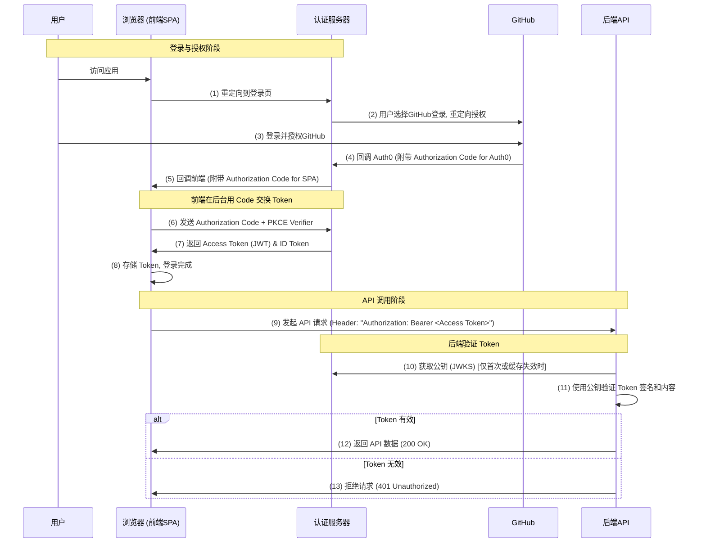

# OAuth 2.0 & OIDC 前后端认证逻辑深度解析 (以 Auth0 为例)

本文档旨在详尽解释在使用 Auth0 实现单页应用 (SPA) + 后端 API 认证时，前后端的具体校验逻辑，并汇总了常见的概念问题。

---

## 核心概念

在深入流程之前，先理解几个关键概念：

*   **OAuth 2.0**: 一个**授权**框架。它允许用户授权一个应用（客户端）代表他们去访问受保护的资源，而无需共享密码。核心是 **Access Token**。
*   **OpenID Connect (OIDC)**: 构建在 OAuth 2.0 之上的**身份认证**层。它在 OAuth 流程的基础上增加了 **ID Token**，用于告诉客户端“当前登录的用户是谁”。
*   **角色**:
    *   **Resource Owner**: 资源的所有者，即**用户**。
    *   **Client**: 请求访问资源的应用，即我们的**前端 SPA (AskC UI)**。
    *   **Authorization Server**: 负责验证用户身份并签发令牌的服务器，即 **Auth0**。
    *   **Resource Server**: 存放受保护资源的服务器，即我们的**后端 API (AskC Backend)**。
*   **Token 类型**:
    *   **Access Token**: 访问令牌（通常是 JWT 格式），用于授权访问后端 API。它的有效期相对较短。
    *   **ID Token**: 身份令牌 (JWT)，包含用户的身份信息（如 email, name, sub）。
    *   **Refresh Token**: 刷新令牌，用于在 Access Token 过期后，以静默方式获取新的 Access Token，有效期很长。
*   **非对称加密 (RS256)**: Auth0 使用一对密钥（私钥和公钥）来签名 JWT。
    *   **私钥**: 只有 Auth0 拥有，用于**签名**。
    *   **公钥**: 公开，用于**验证**签名。任何人都可以获取，但无法用它来伪造签名。

---

## 完整认证与 API 调用流程图

---

## 前端校验逻辑 (SPA)

前端的核心职责是**获取和使用 Token**，而不是验证它。

### `auth0-spa-js` 的作用

这个库为我们处理了所有复杂的认证逻辑：
1.  **处理重定向**: 安全地将用户重定向到 Auth0 并返回。
2.  **PKCE 流程**: 自动处理 Code Challenge 和 Verifier，取代了在前端使用 Client Secret 的不安全做法。
3.  **交换令牌**: 在后台用一次性的 Authorization Code 向 Auth0 换取 Access Token 和 ID Token。
4.  **安全存储**: 将获取到的 Token 存储在内存或浏览器的 `localStorage` 中。

### Token 生命周期管理 (关键问题：Token 过期怎么办？)

前端**不会**等到后端校验失败才反应。`auth0-spa-js` 库通过 `getTokenSilently()` 函数实现了主动、智能的管理：

1.  **检查缓存**: 当代码调用 `getTokenSilently()` 时，SDK 首先检查**内存缓存**中是否有一个**未过期**的 Access Token。如果有，直接返回，避免了不必要的网络请求。

2.  **静默刷新**: 如果缓存中的 Token 已过期或不存在，SDK 会自动在后台（通过一个隐藏的 iframe）使用 **Refresh Token** 向 Auth0 请求一个新的 Access Token。
    *   **成功**: 新 Token 会被缓存并返回。这对用户完全透明，API 调用会无缝衔接。
    *   **失败**: 如果 Refresh Token 也失效了（例如用户长时间未活动），`getTokenSilently()` 会抛出错误。

3.  **处理失败**: 在最坏情况下（静默刷新失败），API 请求会因缺少有效 Token 而被后端拒绝（返回 401）。前端的全局错误处理逻辑应该捕获这个 401 错误，并调用 `login()` 函数，引导用户重新登录。

---

## 后端校验逻辑 (API)

后端的职责是**验证**收到的每一个 Access Token，确保它是真实、有效、且未被篡改的。

### 为什么后端不需要 Client Secret？

如核心概念所述，后端作为资源服务器，只需验证 Token 的签名。由于 Token 是用 Auth0 的**私钥**签名的，后端只需获取 Auth0 的**公钥**即可验证，全程无需 Client Secret。

### 为什么公钥公开，JWT 却不能伪造？

这是非对称加密的核心。**公钥只能用于验证，不能用于签名**。黑客虽然能拿到公钥，但他没有对应的 Auth0 私钥，所以他无法制作出一个能通过公-钥验证的签名。任何由黑客自己签名的 JWT 都会在验证步骤中失败。

### 详细验证步骤 (Checklist)

一个健壮的后端 JWT 验证流程应包含以下所有检查：
1.  从 HTTP 请求头 `Authorization: Bearer <token>` 中提取 Token。
2.  解码 JWT（不验证），读取 Header 中的 `alg`（算法，应为 RS256）和 `kid`（密钥ID）。
3.  从 Auth0 的 JWKS URI (`https://<YOUR_AUTH0_DOMAIN>/.well-known/jwks.json`) 获取公钥列表。
4.  使用 `kid` 从列表中找到匹配的公钥。
5.  **使用公钥验证 Token 的签名**。如果失败，立即拒绝。
6.  **验证 Payload (Claims)**：
    *   **`iss` (Issuer)**: 必须与您的 Auth0 Domain 完全匹配。
    *   **`aud` (Audience)**: 必须与您在 Auth0 中为该 API 配置的 Identifier (`https://api.askc.dev`) 匹配。
    *   **`exp` (Expiration Time)**: 必须是未来的一个时间戳。
    *   检查 `sub` (Subject) 来识别用户。
7.  所有检查通过后，才认为请求是合法的。

---

## Q&A 汇总

*   **Authorization Code 的有效期是多久？**
    *   非常短（默认1分钟），且只能使用一次。

*   **每次调用后端都要申请一次 Authorization Code 吗？**
    *   不。Code 只在登录时用一次，用于换取 Access Token。后续 API 调用都使用 Access Token。

*   **Access Token 的有效期是多久？**
    *   可在 Auth0 API 设置中配置，通常是几小时（默认24小时）。它可以通过 Refresh Token 自动刷新。

*   **在哪里配置 Client Secret？**
    *   **前端**：绝对不能配置。
    *   **后端**：在我们的场景下（验证用户 Token）**不需要**。只有当后端需要以自己的身份调用 Auth0 API 时才需要。
