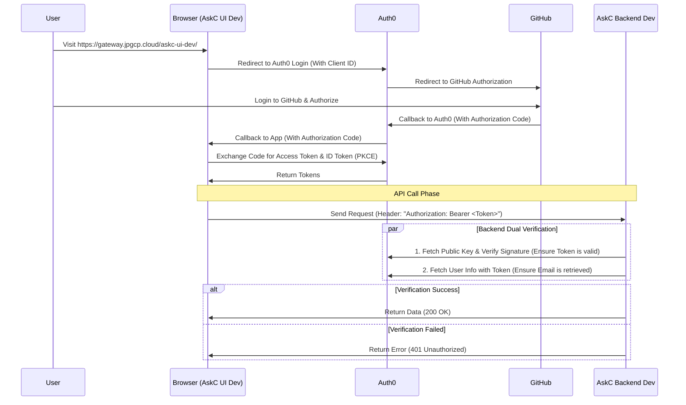

# Deep Dive: Auth0 Authentication Flow & Security Mechanisms

This article aims to explain our Auth0 authentication system in plain language. We'll go beyond "how to do it" and explain "why we do it this way" and the core security principles behind it.

## 1. Core Concepts at a Glance

Before we start, let's align on a few key terms:

*   **OAuth 2.0**: This is an "authorization key". Its core task is to allow users to securely authorize our application to access certain resources (like backend APIs) without sharing their username and password directly with the app. The **Access Token** is this key.
*   **OpenID Connect (OIDC)**: This is an "identity card". Built on top of OAuth 2.0, it adds an identity layer. It issues an **ID Token** to tell the frontend "who is logged in right now" (including avatar, nickname, etc.).
*   **Asymmetric Encryption (RS256)**: This is the cornerstone of Auth0 security. Auth0 signs tokens with its **Private Key**, and our backend verifies the signature using Auth0's public **Public Key**.
    *   **The Beauty**: Since only Auth0 has the private key, signatures cannot be forged; since the public key is public, anyone can verify the token's authenticity.

---

## 2. The Complete Authentication Journey

Let's follow a user from clicking "Login" to seeing data:

---

## 3. Frontend Intelligence: `auth0-spa-js`

Our frontend uses a powerful library, `auth0-spa-js`, which handles all the heavy lifting.

### What does it do?
1.  **Auto-Redirect**: You don't need to manually build URLs; it automatically takes you to the Auth0 login page.
2.  **PKCE Security**: This is critical. It automatically generates and verifies the "Code Challenge", completely replacing the insecure practice of using Client Secrets on the frontend. **This is why the frontend code absolutely does not need a Client Secret.**
3.  **Silent Refresh**: When the Access Token is about to expire, it quietly asks Auth0 for a new one in the background (via iframe). The user perceives nothing and is never suddenly kicked out due to token expiration.

### What if the Token Expires?
No worries. When we call `getTokenSilently()`:
1.  It checks memory: Is there a valid token? If yes, use it.
2.  If not? It automatically tries to refresh one.
3.  Only if the user hasn't logged in for a long time and refresh fails, will it throw an error, at which point we ask the user to login again.

---

## 4. Backend Rigor: JWT Verification

The backend's job is simple but strict: **Trust No One**. Every token attached to a request must go through rigorous security checks.

### Why does the backend not need a Client Secret either?
Remember asymmetric encryption? The backend only needs to **verify** the token is real, and verification only requires the **Public Key**. Since the Public Key is publicly downloadable, the backend doesn't need to hold any confidential Secrets to complete verification.

### Verification Checklist
Every time the backend receives a request, it performs these checks in order:
1.  **Decrypt Header**: Reads the token header, confirms the algorithm is RS256.
2.  **Find Key**: Uses the ID in the token to find the corresponding key from Auth0's public key list.
3.  **Verify Signature**: Unlocks the signature using the public key to check if the content has been tampered with. This step blocks 99% of attacks.
4.  **Verify Payload**:
    *   **Issuer**: Was it issued by `askc-dev.uk.auth0.com`?
    *   **Audience**: Is it intended for `https://api.askc.dev`?
    *   **Expiration**: Is it expired?
5.  Only if all pass, is the request allowed.

---

## 5. FAQ

*   **Q: How many times can an Authorization Code be used?**
    *   A: **Once**. And it has a very short validity period (usually 1 minute). This greatly reduces the risk of interception.

*   **Q: Do we need to verify with Auth0 for every backend API call?**
    *   A: **No**. Verification is done locally on the backend via mathematical calculation using the public key. No network call to Auth0 is needed (except for fetching the public key the first time).

*   **Q: Why do we have both Access Token and ID Token?**
    *   A: Separation of concerns. The Access Token is for the **API** (for authorization), and the ID Token is for the **Frontend** (for displaying user info).
